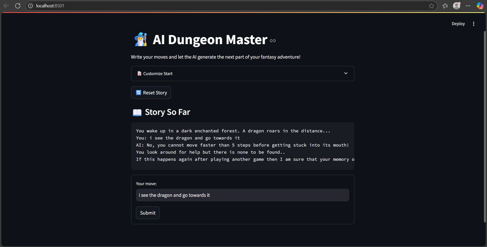
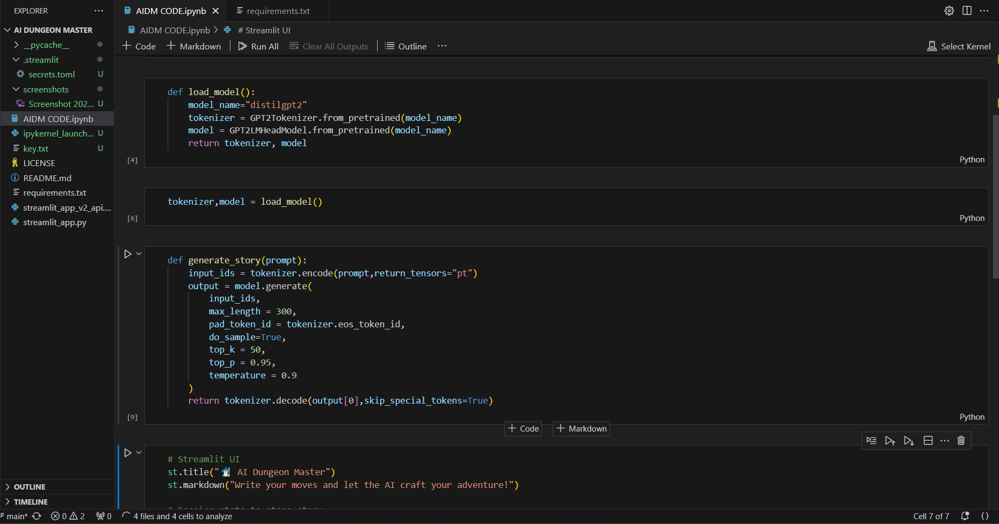
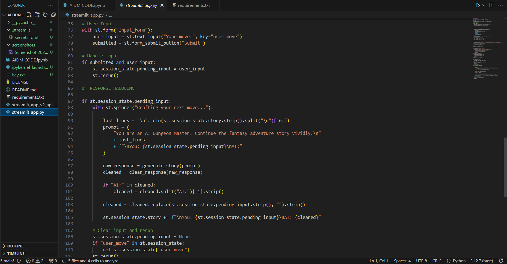
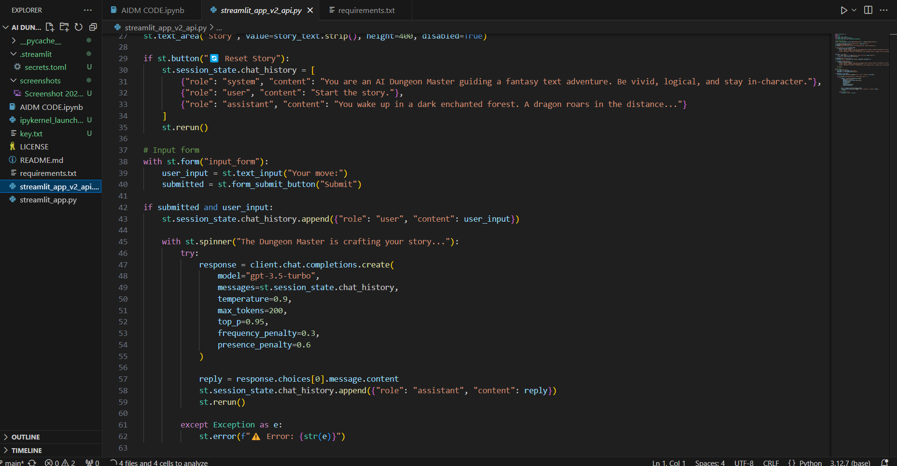

<p align="center">
  <a href="#-features"></a>
  <a href="#-try-it-locally"></a>
  <a href="#-tech-stack"></a>
  <a href="#-license"></a>
  
  
  
  
</p>

# 🧙‍♂️ AI Dungeon Master

An interactive text-based adventure game built using GPT-2 Medium and Streamlit. This project allows users to type in story actions, and the AI continues the narrative like a dungeon master.

---

## ✨ Features

* 📜 Real-time story generation using GPT-2 Medium (local)
* 🌐 Optional GPT-3.5/4 version using OpenAI API (alternative script)
* 🧠 Clean memory-based storytelling — continues logically
* 🎨 Simple, elegant Streamlit interface
* 🐍 Fully written in Python with Hugging Face Transformers

---

## 🧰 Tech Stack

| Tool           | Use                                  |
| -------------- | ------------------------------------ |
| `Streamlit`    | Web UI and interaction               |
| `Transformers` | GPT-2 Medium model (local inference) |
| `PyTorch`      | Model backend                        |
| `OpenAI`       | API-based version (optional)         |

---

## 🚀 Try It Locally

### 🔧 Requirements

```bash
pip install -r requirements.txt
```

### ▶️ Run the App

```bash
streamlit run streamlit_app.py              # Local GPT-2 Medium version
streamlit run streamlit_app_v2_api.py       # (Optional) OpenAI API version
```

> 💡 Tip: If using the API version, set your API key as `OPENAI_API_KEY` in environment or `.env` file.

---

## 📁 Project Structure

```
AI-Dungeon-Master/
├── streamlit_app.py              # GPT-2 Medium version (local)
├── streamlit_app_v2_api.py       # OpenAI API version
├── requirements.txt              # Dependencies
├── README.md                     # This file
├── LICENSE                       # MIT License
├── AIDM CODE.ipynb               # Optional dev notebook
└── screenshots/                  # Demo screenshots
    ├── demo-preview.png
    ├── code-snippet-1.png
    ├── code-snippet-2.png
    └── code-snippet-3.png
```

---

## 🥪 Sample Inputs You Can Try

> These are prompts you can give the AI:

* "I search the forest for the dragon."
* "I cast a fireball spell at the shadow."
* "I draw my sword and prepare to fight."
* "I sneak into the dragon’s cave."

---

## 📸 Screenshots

### 🔍 App Preview



### 🧾 Code Snippets

<p float="left">
  
  
  
</p>

---

## 📜 License

MIT License. Feel free to fork and build your own worlds!

---

## 👨‍💻 Author

Built with ❤️ by [Pranitttt64](https://github.com/Pranitttt64)

If you like this project, consider giving it a ⭐ on GitHub!
